# Hosting and Formatting Resume on GitHub Pages

## Purpose

This README outlines the practical steps for hosting and formatting a resume on GitHub Pages, demonstrating these processes in line with the principles of current Technical Writing as outlined by Andrew Etter in his book *Modern Technical Writing*.

## Prerequisites

1. A [resume](https://github.com/Zzz032/zzz032.github.io/blob/main/index.md) formatted in Markdown 
2. A GitHub account, such like that [my account](https://github.com/Zzz032) and also need a [Github Desktop](https://desktop.github.com/).
3. Familiarity with Markdown. and this is the [Markdown Tutorial](https://www.markdowntutorial.com/).
4. The Visual Studio Code, if you have never use this one, you can download it [here](https://code.visualstudio.com/)

## Contents
- [Hosting and Formatting Resume on GitHub Pages](#hosting-and-formatting-resume-on-github-pages)
  - [Purpose](#purpose)
  - [Prerequisites](#prerequisites)
  - [Contents](#contents)
  - [Instructions](#instructions)
    - [1. Create a GitHub Repository](#1-create-a-github-repository)
    - [2. Add Resume to the Repository](#2-add-resume-to-the-repository)
    - [3. Jekyll](#3-jekyll)
    - [4. Enable GitHub Pages](#4-enable-github-pages)
  - [Technical writing](#technical-writing)
  - [FAQs](#faqs)
  - [More Resources](#more-resources)
  - [Authors and Acknowledgements](#authors-and-acknowledgements)

## Instructions

### 1. Create a GitHub Repository

**Relating to Etter's Principles**: Utilize lightweight tools and distributed version control systems, as Etter recommends.

1. Sign into GitHub and click the '+' icon at the top right to select 'New Repository'.
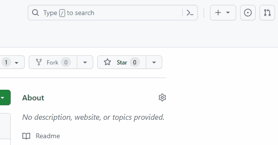
2. Name my repository `username.github.io`, replacing `username` with my GitHub username.
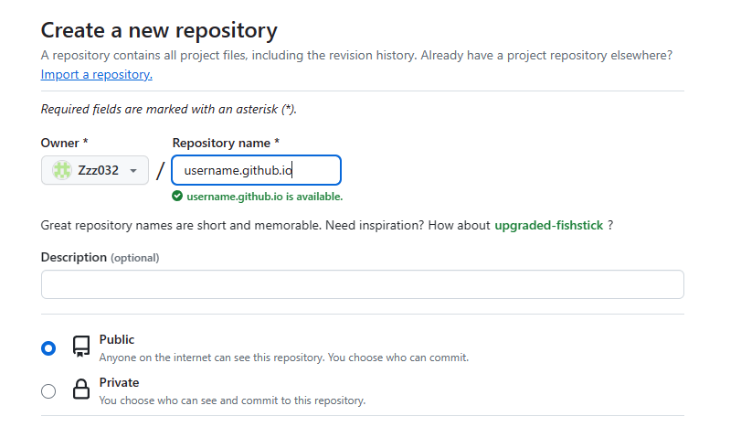
3. Set the repository to Public and initialize it with a README.
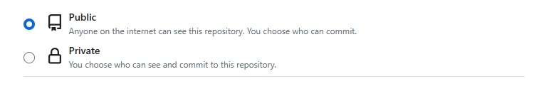

### 2. Add Resume to the Repository
1. Open the GitHub Desktop
2. Sign in your Github account.

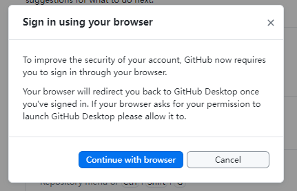

1. Clone the repository.
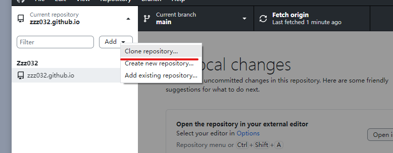
1. Select the the new repository that your just created clone it.
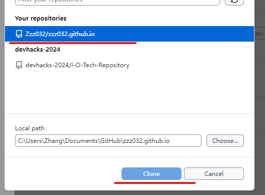
1. Wait for the GitHub Desktop refreshing.

6. Open in Visual Studio Code
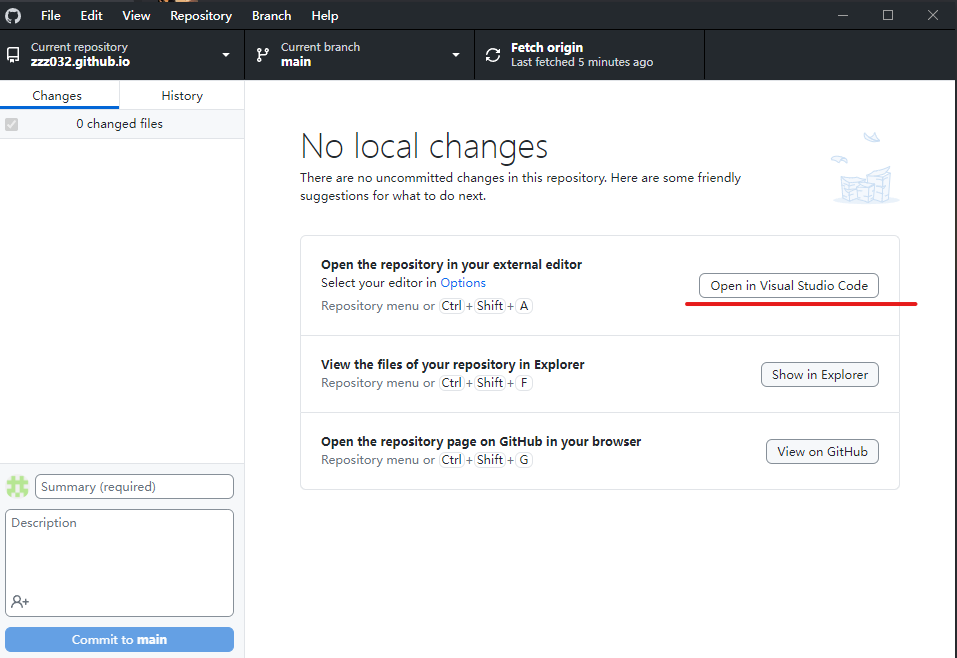
7. Add my Markdown-formatted resume (`index.md`) to the repository(under the EXPLORER).
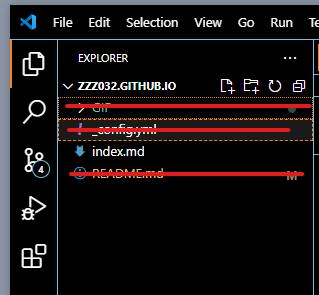
8. Choose the `File` and click the `Save All` button to save the change
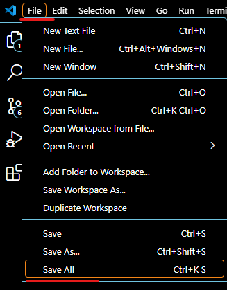
1. Back to Github Desktop, click the commit button.
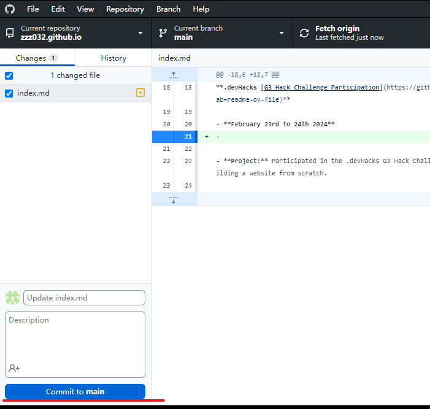
1.  Right now, we can push the index.md (resume) to the Github
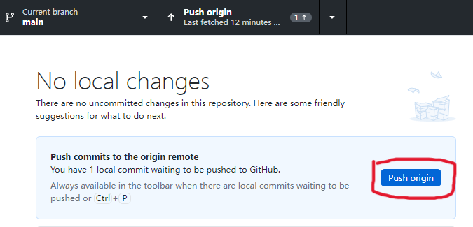

### 3. Jekyll

1. go to [website](https://pages.github.com/themes/) choose one theme
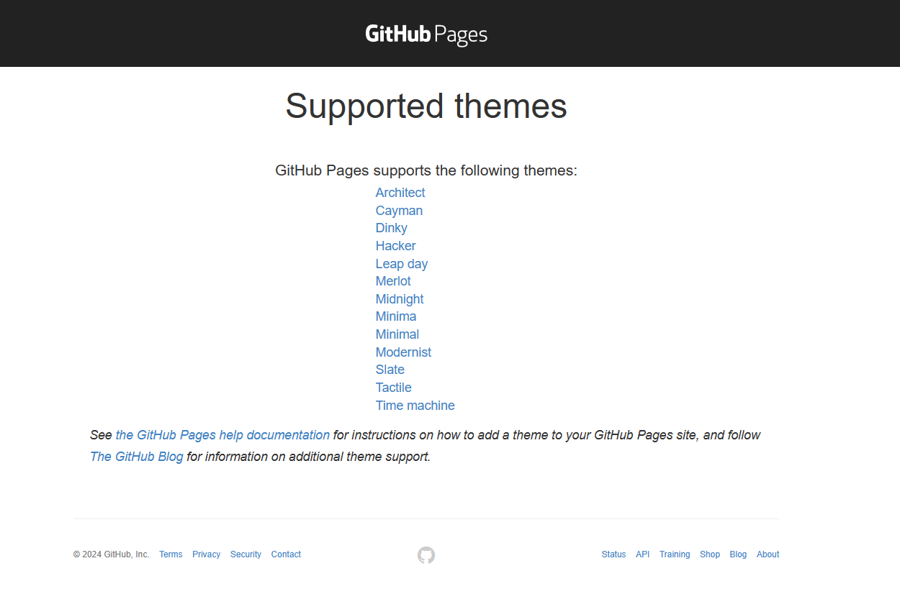
   
2. in the theme there will be a usage of this theme
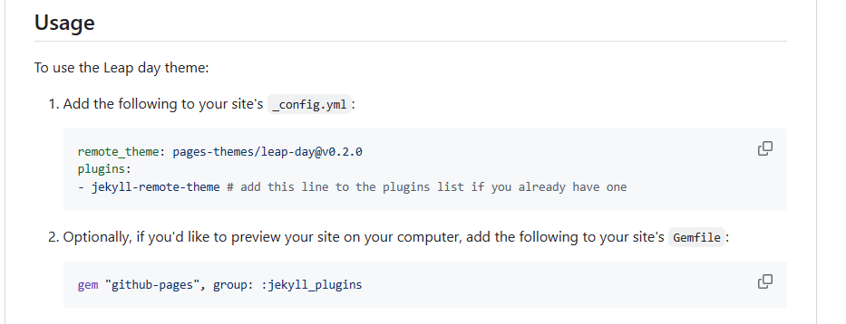

3. Following the 1-6 steps in [2. Add Resume to the Repository](#2-add-resume-to-the-repository)

4. In the Visual Studio Code, Right-click on the empty space below the EXPLORER and select the `New File`
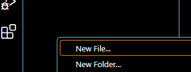
5. Name the new file `_config.yml`

6. Open this file
7. copy the usage to the `_config.yml` file
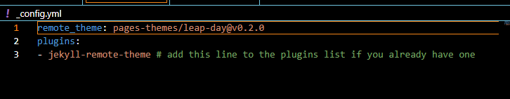  
8. Following the 8-10 steps in [2. Add Resume to the Repository](#2-add-resume-to-the-repository) to push this `_config.yml` file into Github

### 4. Enable GitHub Pages

1. On the top Github page, select the `setting` button
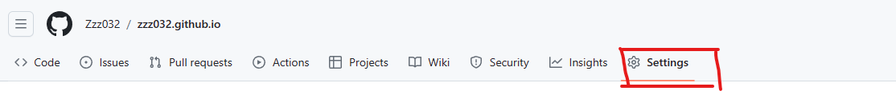
2. In my repository settings, find the "Pages" section.
3. Select my main branch as the source.
4. Save, and my resume is now live at `https://username.github.io`.
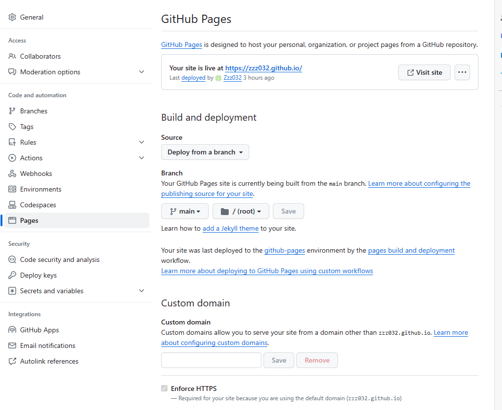

## Technical writing

1. **Use a Lightweight Markup Language**: Lightweight markup languages, such as Markdown, are designed for simplicity and ease of use. They enable writers to format text without the overhead of traditional word processors. This approach benefits technical writing by:

   - **Simplicity**: Markdown's syntax is straightforward, making it easy to learn and use for both technical and non-technical users.
   - **Portability**: Documents written in Markdown are plain text, ensuring compatibility across different platforms and devices.
   - **Versatility**: Markdown files can be converted to various formats (e.g., HTML, PDF) using different tools, making it suitable for a wide range of documentation needs.

2. **Format a Document with a Static Site Generator**: Static site generators, like Jekyll, transform plain text into static websites. This is particularly useful for technical documentation because:

   - **Theme Support**: Static site generators often support themes, allowing documentation to be presented in a visually appealing and consistent manner without requiring extensive web development skills.
   - **Content Management**: They separate content from presentation, enabling writers to focus on writing while maintaining a professional layout and design.
   - **Automation**: These tools automate website building and updating processes, streamlining the deployment and maintenance of documentation.

3. **Share/Host Documents on a Distributed Version Control System**: Version control systems like Git, coupled with platforms like GitHub, offer a robust framework for hosting, sharing, and collaborating on documentation.

   - **Collaboration**: They facilitate teamwork, allowing multiple contributors to work on documents simultaneously, propose changes, and review each other's contributions.
   - **Version Tracking**: Version control systems keep a detailed history of changes, making it easy to track progress, revert mistakes, and understand document evolution over time.
   - **Accessibility**: Hosting documents on platforms like GitHub Pages makes them accessible to a wide audience, ensuring that users can easily find and view the documentation.

## FAQs

**Why use Markdown for a resume?**
Markdown is preferred for its simplicity, portability, and version control friendliness—key advantages highlighted by Etter for technical documents.

**Why isn't my resume appearing on GitHub Pages?**
Ensure the repository is named correctly (`username.github.io`), and GitHub Pages is enabled in my repository settings. It may take a few minutes for changes to go live.

## More Resources

- [Markdown Tutorial](https://www.markdowntutorial.com/)
- [GitHub Docs: Basic writing and formatting syntax](https://docs.github.com/en/get-started/writing-on-github/getting-started-with-writing-and-formatting-on-github/basic-writing-and-formatting-syntax)
- [Jekyll Themes for GitHub Pages](https://pages.github.com/themes/)
- [Etter's *Modern Technical Writing*](https://www.amazon.com/Modern-Technical-Writing-Introduction-Documentation-ebook/dp/B01A2QL9SS)
- [Markdown Guide](https://www.markdownguide.org/getting-started/)

## Authors and Acknowledgements

- **Author:** Yuelang Zhang
- **Acknowledgement 1:** Thanks to resources and mentors for guidance.
- **Acknowledgement 2:** Thanks to mattgraham for the Github Jekyll theme!
