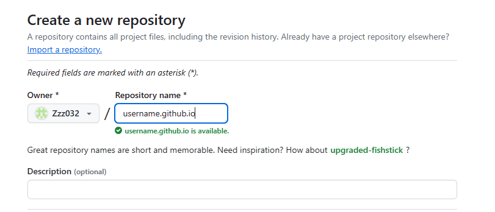

# Hosting and Formatting Resume on GitHub Pages

## Purpose

This README outlines the practical steps for hosting and formatting a resume on GitHub Pages, demonstrating these processes in line with the principles of current Technical Writing as outlined by Andrew Etter in his book *Modern Technical Writing*.

## Prerequisites

1. A [resume](https://github.com/Zzz032/zzz032.github.io/blob/main/index.md) formatted in Markdown 
2. A GitHub account, such like that [my account](https://github.com/Zzz032) and also need a [Github Desktop](https://desktop.github.com/).
3. Familiarity with Markdown. and this is the [Markdown Tutorial](https://www.markdowntutorial.com/).
4. The Visual Studio Code, if you have never use this one, you can download it [here](https://code.visualstudio.com/)

## Contents
- [Hosting and Formatting Resume on GitHub Pages](#hosting-and-formatting-resume-on-github-pages)
  - [Purpose](#purpose)
  - [Prerequisites](#prerequisites)
  - [Contents](#contents)
  - [Instructions](#instructions)
    - [1. Create a GitHub Repository](#1-create-a-github-repository)
    - [2. Add Resume to the Repository](#2-add-resume-to-the-repository)
    - [3. Enable GitHub Pages](#3-enable-github-pages)
  - [Jekyll](#jekyll)
  - [Technical writing](#technical-writing)
    - [Use Plain Language](#use-plain-language)
    - [Write for the Web](#write-for-the-web)
    - [Use a Minimalist Approach](#use-a-minimalist-approach)
    - [Use a Structured Approach](#use-a-structured-approach)
    - [Use a Version Control System](#use-a-version-control-system)
    - [Write in Markdown](#write-in-markdown)
    - [Use Screenshots and Diagrams](#use-screenshots-and-diagrams)
  - [FAQs](#faqs)
  - [More Resources](#more-resources)
  - [Authors and Acknowledgements](#authors-and-acknowledgements)

## Instructions

### 1. Create a GitHub Repository

**Relating to Etter's Principles**: Utilize lightweight tools and distributed version control systems, as Etter recommends.

1. Sign into GitHub and click the '+' icon at the top right to select 'New Repository'.

2. Name my repository `username.github.io`, replacing `username` with my GitHub username.

3. Set the repository to Public and initialize it with a README.

### 2. Add Resume to the Repository

1. Clone my new repository to my local machine using Git.

2. Add my Markdown-formatted resume (`index.md`) to the repository.
3. Commit and push the changes back to GitHub.

### 3. Enable GitHub Pages

1. In my repository settings, find the "Pages" section.
2. Select my main branch as the source.
3. Save, and my resume is now live at `https://username.github.io`.

## Jekyll

1. go to [website](https://pages.github.com/themes/) choose one theme

   
2. in the theme there will be a usage of this theme

   
3. copy this usage to the `_config.yml` file
  

4. and try to run the github page website 

## Technical writing

### Use Plain Language

**Before**: "Utilize lightweight tools and distributed version control systems, as Etter recommends."

**After**: "Use simple tools and share the work online with tools like GitHub, as suggested by Andrew Etter."

### Write for the Web

- **Organize the content** into short, digestible sections.
- **Use bullet points** for lists, like in my "Prerequisites" section, to keep information clear and easy to scan.

### Use a Minimalist Approach

**Before**: "Sign into GitHub and click the '+' icon at the top right to select 'New Repository'."

**After**: "Sign into GitHub, click '+', and choose 'New Repository'."

### Use a Structured Approach

- **Break down instructions** into numbered steps to guide readers through the process in an organized manner.
- **Clearly label sections** like "Instructions," "More Resources," and "FAQs" to help readers navigate to the information they need.

### Use a Version Control System

- Mention the **importance of using GitHub** for version control in the instructions, highlighting how it helps keep the resume updated.

### Write in Markdown

- Emphasize the **benefits of Markdown** for creating resume, noting its simplicity and versatility.

### Use Screenshots and Diagrams

- Include **screenshots** or **animated GIFs** to visually guide users through the steps, such as creating a repository, adding a resume file, and enabling GitHub Pages.

Applying these principles, README becomes more accessible, user-friendly, and effective in conveying the necessary steps to host and format a resume on GitHub Pages. Here's how a section could be improved:

**Before**: 
"Clone my new repository to my local machine using Git. Add my Markdown-formatted resume (`index.md`) to the repository. Commit and push the changes back to GitHub."

**After**: 
"1. **Clone repository**: Use Git to copy my repository to my computer. 
1. **Add the resume**: Put `index.md` resume file in the repository.
2. **Update GitHub**: Save the changes and upload them back to GitHub."

## FAQs

**Why use Markdown for a resume?**
Markdown is preferred for its simplicity, portability, and version control friendliness—key advantages highlighted by Etter for technical documents.

**Why isn't my resume appearing on GitHub Pages?**
Ensure the repository is named correctly (`username.github.io`), and GitHub Pages is enabled in my repository settings. It may take a few minutes for changes to go live.

## More Resources

- [Markdown Tutorial](https://www.markdowntutorial.com/)
- [GitHub Docs: Basic writing and formatting syntax](https://docs.github.com/en/get-started/writing-on-github/getting-started-with-writing-and-formatting-on-github/basic-writing-and-formatting-syntax)
- [Jekyll Themes for GitHub Pages](https://pages.github.com/themes/)
- [Etter's *Modern Technical Writing*](https://www.amazon.com/Modern-Technical-Writing-Introduction-Documentation-ebook/dp/B01A2QL9SS)
- [Markdown Guide](https://www.markdownguide.org/getting-started/)

## Authors and Acknowledgements

- **Author:** Yuelang Zhang
- **Acknowledgements:** Thanks to resources and mentors for guidance.